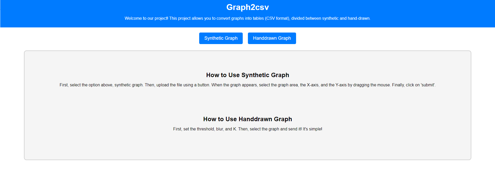

# Graph2CSV

Graph2CSV is a tool designed to convert both synthetic and hand-drawn graphs into CSV (Comma-Separated Values) format. This tool simplifies the process of extracting data from graphical representations, enabling easy data analysis and manipulation.

## Features

- **Synthetic Graph Conversion:** Convert synthetic graphs generated by software or simulations into CSV format.
- **Hand-Drawn Graph Conversion:** Transform hand-drawn graphs into CSV for data extraction and analysis.
- **Simplified Data Extraction:** Easily extract data points and values from graphs for further analysis or manipulation.

## How to Use

1. **Synthetic Graphs:**
   - Upload the synthetic graph image using the provided functionality.
   - Configure any specific settings or parameters if required.
   - Click 'Convert' to obtain the CSV file with extracted data.

2. **Hand-Drawn Graphs:**
   - Upload the hand-drawn graph image.
   - Adjust any necessary settings for threshold, blur, K values, etc.
   - Click 'Process' to generate the corresponding CSV file.
